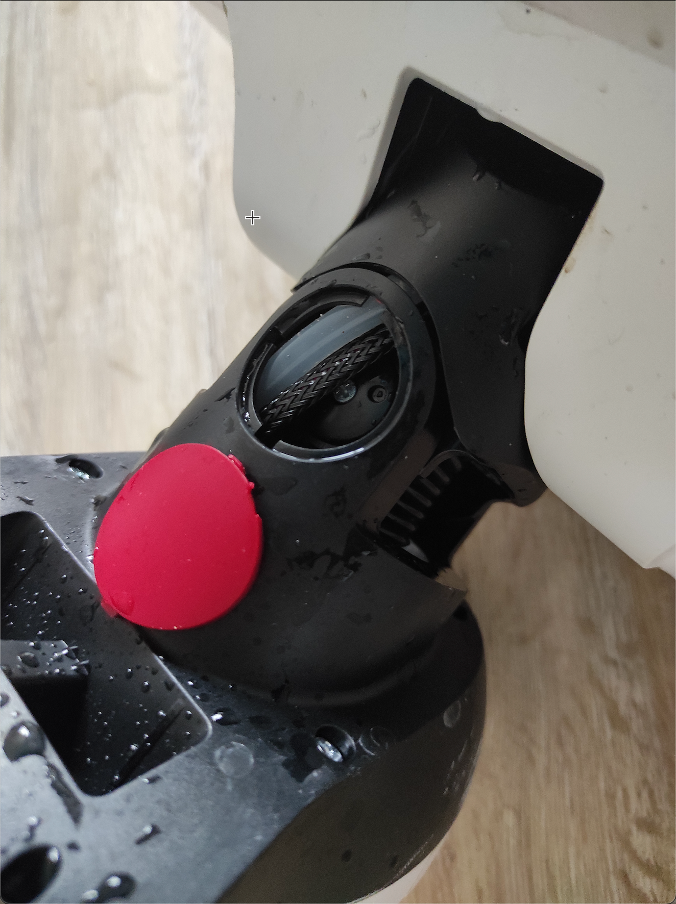
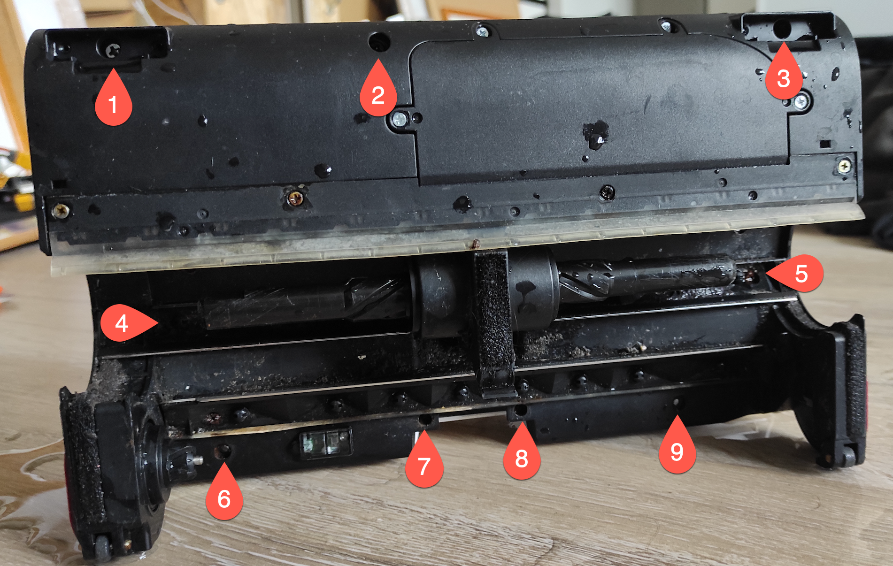
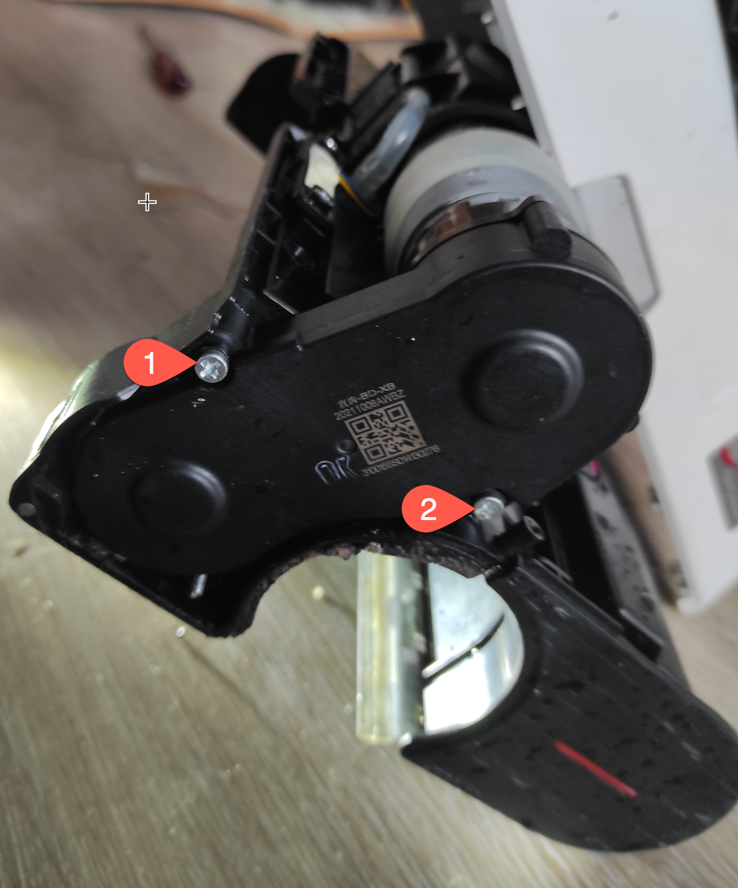
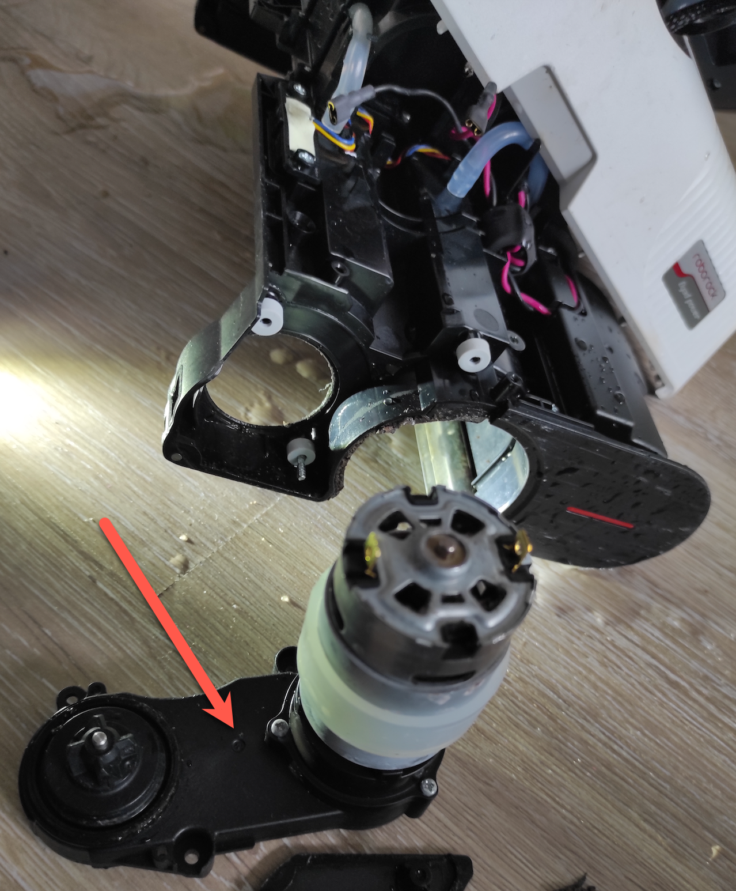

[//]: # (name: google-site-verification)  
[//]: # (content: zHtngpZk7SvyyfmoQQHeWS9Ztf7nGFLJgCxgiFxIDX0)  

# RoboRock Dyad - Disassembly Instructions

My RoboRock Dyad had a clacking noise today which culminated in the big front brush not rotating anymore. From the noise I expected a stripped gear so I wanted to disassemble it but found absolutely no resources online. In here I want to document how to disassemble the lower part of the device to repair the problem.

---

## (Optional) Disconnect the Neck

1. Pop off the red caps on both sides with a screw driver
    
1. Remove the two screws on each side
1. Remove the black cap from both sides
    
1. Press together the inner parts to detach the two parts (harder than it sounds!)

---

## Open the Lower Housing

1. Remove the 9 screws that are marked in the picture. You need to remove the small wheels in the back to access two of those screws.
    
1. Use a spudger or screw driver to pop off the white upper housing

## Remove the Side Cover of the Main Brush Drive Assembly

1. Remove one screw on the top and one on the inside of the brush housing as shown in the two pictures
    
    

## Remove Main Brush Drive Assembly

1. Remove the two screws
    
1. Pull out the whole assembly to the side
1. Detach wires from motor (just pull them off)
    

    >You can replace this complete assembly including the motor with a new part from aliexpress (cost ~35 Euros).

## (Optional) Disassemble Main Brush Drive Assembly

I wanted to go deeper and find the root of the problem. So I removed the motor:
    

The gears in the planetary drive and the coupling looked fine. Unfortunately the transmission assembly is glued together but it can be pried apart with little damage with a spudger and small flat head screw drivers.
    

I was surprised by the amount of dirt in the assembly.

The reason for the problem is now obvious. Some of the teeth were stripped from the belt, I find that quite surprising as these type of belts are nigh indestructible.
    

Luckily its a standard part and can be ordered for around 4 Euros from ebay. Its a 6mm HTD 3M with a circumference length of 189mm. Search for ‘HTD 3M 6mm’, usually you can then choose the required length.
    

Cheers!

